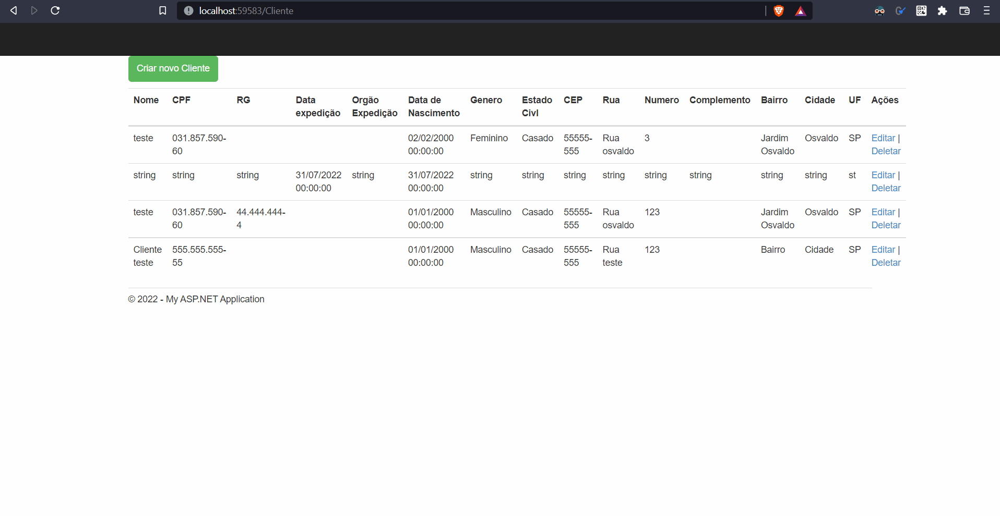

# MVC-API_BasicCrud
Sistema MVC básico para aprender mais sobre o tratemento de model e criação de API para comunicação com o banco (Disponibilizado em .MDF para facilidade de rodar a aplicação).

## Validações
O sistema MVC apresenta uma grid e uma tela para cadastro/update de informações dos clientes, a validação é feita com o ModelState que dispara as mensagens de erro do C# caso algun dado obrigatório não esteja inserido. 
O campo de CPF tem uma validação extra para verificar se o CPF é válido.

## Web API
O projeto tem o swagger com a finalidade de facilitar o uso e testes da API. 

